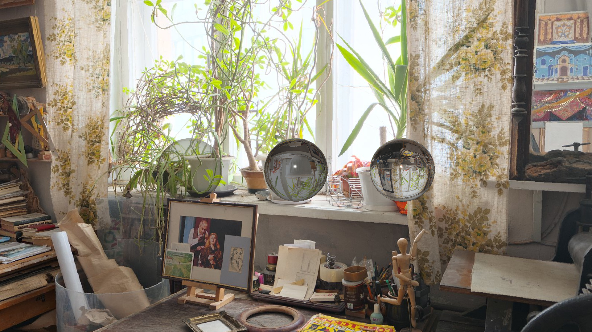
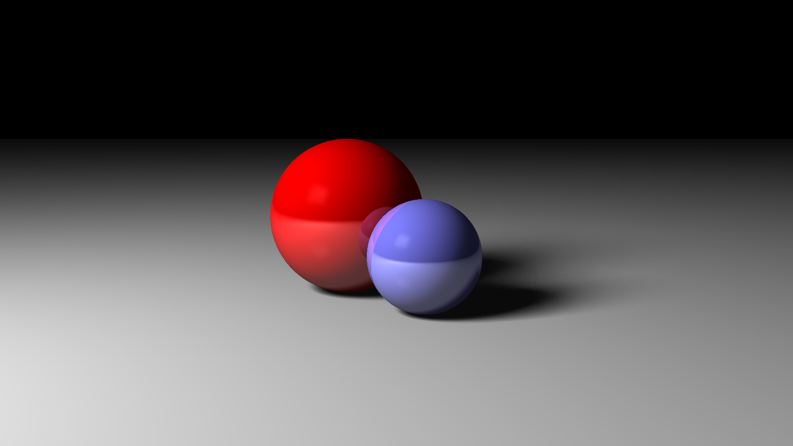
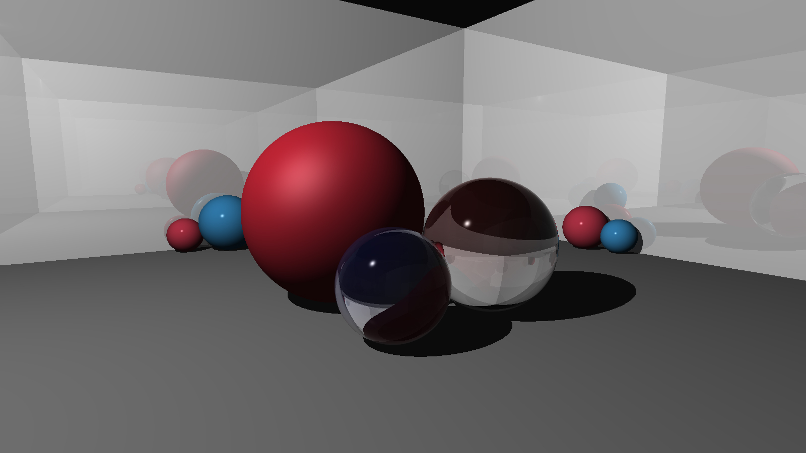

# Ray Tracer
### :sunny: 3D raytracer on a CPU built from scratch with minimal dependencies for educational purposes.

## Renders



## Overview
### Notable features
* Sphere, plane & cube primitives.
* Reflections and refraction.
* Soft shadows.
* Built-in patterns (e.g. Checkers, Gradient).
* Texture mapping.
* Loading scene from a JSON file.
### Scene description example (1st image)
```javascript
{
  "camera": {
    "height": 1920,
    "width": 1080,
    "fov": 0.8,
    "from": [ 0, 1, -10 ],
    "to": [ 0, 0, 0 ],
    "up": [ 0, 1, 0 ]
  },
  "lights": {
    "pointLights": [
      {
        "position": [ -0.5, 3, -10 ],
        "intensity": [ 1, 1, 1 ]
      }
    ],
    "areaLights": []
  },
  "textures": [
    {
      "name": "skybox",
      "pattern": "image",
      "imagePath": "Skyboxes/artist_workshop.jpg",
      "mapping": "sphere"
    }
  ],
  "materials": [
    {
      "name": "sphere1",
      "color": [ 0.12, 0.12, 0 ],
      "ambient": 0,
      "diffuse": 0.5,
      "specular": 0.9,
      "shininess": 300,
      "reflective": 0.9,
      "transparency": 0.85,
      "refractiveIndex": 1.0
    },
    {
      "name": "sphere2",
      "color": [ 0.15, 0.15, 0.15 ],
      "ambient": 0,
      "diffuse": 0.4,
      "specular": 0.9,
      "shininess": 300,
      "reflective": 0.85,
      "transparency": 0.7,
      "refractiveIndex": 1.1
    },
    {
      "name": "sphere3",
      "color": [ 0.1, 0.1, 0.1 ],
      "ambient": 0,
      "diffuse": 0.4,
      "specular": 0.9,
      "shininess": 300,
      "reflective": 0.9,
      "transparency": 0.9,
      "refractiveIndex": 1.5
    },
    {
      "name": "skybox",
      "texture": "skybox",
      "ambient": 1.0,
      "diffuse": 0.0,
      "specular": 0.0,
      "shininess": 0,
      "reflective": 0,
      "transparency": 0,
      "refractiveIndex": 1
    }
  ],
  "shapes": {
    "spheres": [
      {
        "translation": [ -2, 0, -0.75 ],
        "scaling": [ 0.6, 0.6, 0.6 ],
        "material": "sphere1"
      },
      {
        "translation": [ -0, 0, -0.75 ],
        "scaling": [ 0.6, 0.6, 0.6 ],
        "material": "sphere2"
      },
      {
        "translation": [ 2, 0, -0.75 ],
        "scaling": [ 0.6, 0.6, 0.6 ],
        "material": "sphere3"
      },
      {
        "scaling": [ 1000, 1000, 1000 ],
        "rotation": [0, 1.12, 0],
        "material": "skybox"
      }
    ],
    "planes": [],
    "cubes": []
  }
}
```
## Dependencies
* [catch](https://github.com/catchorg/Catch2) - for testing.
* [nlohmann/json](https://github.com/nlohmann/json) - for parsing json files with scene descriptions.
* [nothings/stb](https://github.com/nothings/stb) - for writing the renders to files and loading textures.
## Credits
* [The Ray Tracer Challenge: A Test-Driven Guide to Your First 3D Renderer](http://www.raytracerchallenge.com/) by Jamis Buck
* [HDRI Haven](https://hdrihaven.com/)